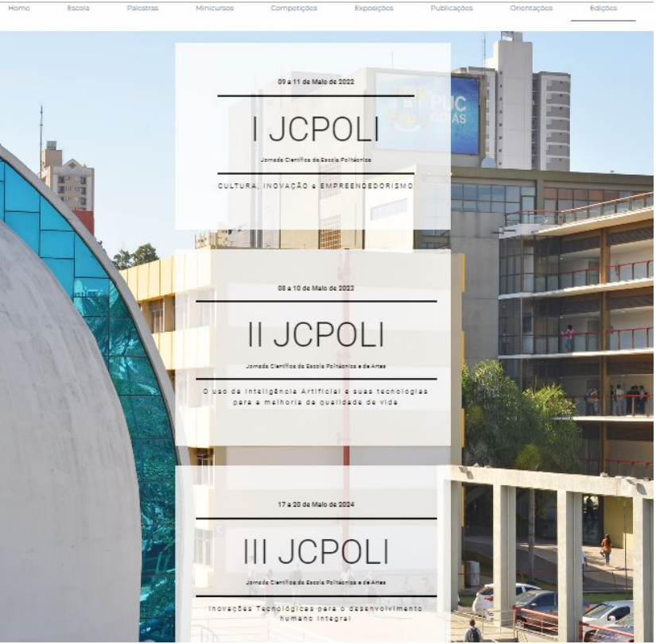
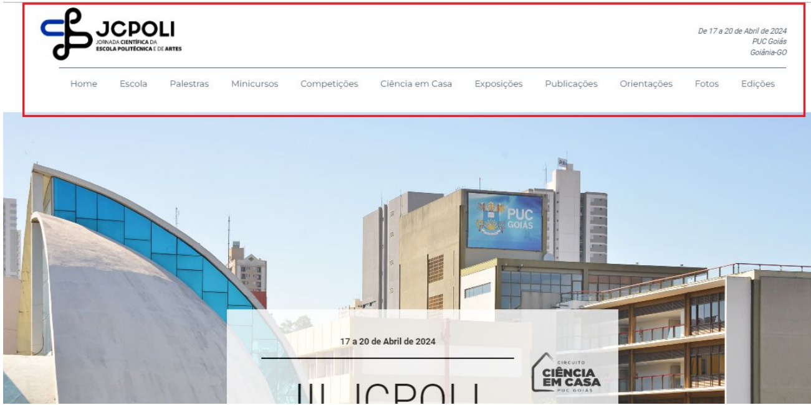

# JCPOLI — Estudo de Caso Técnico

Estudo de caso sobre minha atuação no desenvolvimento e evolução do site da **Jornada Científica da Escola Politécnica e de Artes da PUC Goiás (JCPOLI)** durante meu estágio supervisionado em 2024.

> Este não é o repositório oficial da JCPOLI.
> O objetivo deste repositório é documentar especificamente minha participação técnica em um projeto colaborativo desenvolvido por uma equipe de estagiários.

## Sobre o projeto

A JCPOLI é um evento científico da Escola Politécnica e de Artes da PUC Goiás.

Durante o estágio, participei da evolução do site utilizado para divulgação das diferentes edições do evento, trabalhando principalmente com **Vue.js e TypeScript**.

O trabalho envolveu inicialmente a integração da JCPOLI ao site institucional da Escola Politécnica e de Artes e, posteriormente, uma reorganização da solução para que a JCPOLI voltasse a funcionar como um site independente.

## Minha atuação

Atuei principalmente no desenvolvimento frontend, trabalhando com:

- Vue.js;
- TypeScript;
- JavaScript;
- HTML;
- CSS / Sass;
- Vue Router;
- componentização;
- responsividade;
- Git e GitHub.

Entre as principais contribuições estão:

- integração inicial da JCPOLI ao site da Escola Politécnica;
- criação e adaptação de rotas;
- desenvolvimento e reorganização de páginas e componentes;
- criação da área de edições anteriores;
- implementação de navegação por edição da JCPOLI;
- organização dos componentes e dados por edição;
- implementação das páginas da 2ª e 3ª edições;
- criação de novas áreas como **Ciência em Casa** e **Fotos**;
- atualização de Palestras, Minicursos, Competições, Publicações e Orientações;
- ajustes de responsividade;
- reorganização estrutural após a decisão de separar novamente os sites.

## Principal desafio técnico

Uma das principais dificuldades do projeto foi permitir que diferentes edições da JCPOLI coexistissem dentro da mesma aplicação.



Cada edição possuía conteúdos, palestrantes, minicursos, competições e demais informações específicas.

Como a versão em que trabalhei não utilizava um banco de dados externo para armazenar essas informações, foi necessário organizar os componentes e os dados de maneira que cada edição pudesse ser acessada separadamente sem comprometer a navegação e a manutenção do projeto.

A solução evoluiu para uma estrutura organizada por edição:

```text
components/
└── abasJCPOLI/
    ├── 1_JCPOLI/
    ├── 2_JCPOLI/
    └── 3_JCPOLI/

components/
└── home/
    ├── 1_JCPOLI/
    ├── 2_JCPOLI/
    └── 3_JCPOLI/

storage/
└── programacao/
    ├── 1_JCPOLI/
    ├── 2_JCPOLI/
    └── 3_JCPOLI/
````

O roteamento também passou a considerar a edição acessada para carregar os componentes correspondentes.

## Evolução do projeto

O desenvolvimento passou por diferentes etapas:

```text
Site JCPOLI existente
        ↓
Integração ao site da Escola Politécnica
        ↓
Adaptação de rotas, páginas e navegação
        ↓
Criação da área de edições anteriores
        ↓
Suporte a múltiplas edições
        ↓
Atualizações durante a 3ª JCPOLI
        ↓
Mudança de requisito
        ↓
Separação novamente dos dois sites
        ↓
Reorganização da estrutura da JCPOLI
```

## Stack

**Frontend**

`Vue.js 2` · `TypeScript` · `JavaScript` · `HTML` · `CSS / Sass`

**Ecossistema**

`Vue Router` · `Vue CLI`

**Versionamento**

`Git` · `GitHub`

## Projeto colaborativo

O desenvolvimento foi realizado por uma equipe de estagiários.

Cada integrante trabalhava em branches específicas dentro dos repositórios utilizados pela equipe.

Minhas principais branches durante o projeto foram:

```text
abe-juncaojcpolipolitecnica
abe-sitejcpoli-teste
```

O histórico Git preservado possui dezenas de commits atribuídos diretamente ao meu usuário de desenvolvimento.

Este estudo de caso utiliza esse histórico para diferenciar minhas contribuições do restante do código colaborativo.

## Evidências técnicas

Algumas das alterações preservadas no histórico incluem:

* nova lógica de navegação entre edições;
* reorganização dos componentes por edição;
* criação da área de Edições;
* implementação das páginas da 2ª e 3ª JCPOLI;
* criação de Ciência em Casa e Fotos;
* atualização do layout de Palestras e Minicursos;
* ajustes de responsividade;
* reorganização do projeto após a separação dos sites.

➡️ [Ver detalhamento das minhas contribuições](docs/minhas-contribuicoes.md)

## Documentação

* [Contexto do projeto](docs/contexto.md)
* [Minhas contribuições](docs/minhas-contribuicoes.md)
* [Arquitetura frontend](docs/arquitetura-frontend.md)
* [Evolução do projeto](docs/evolucao-do-projeto.md)
* [Evidências e histórico Git](docs/evidencias.md)

## Sobre o código original

O desenvolvimento ocorreu neste repositório colaborativo [Repositório JCPOLI 3º Edição](https://github.com/unlimitedabe/JCPOLI-2024-3Ed) utilizado pela equipe da JCPOLI.

Este repositório não replica todo o código original nem apresenta o projeto colaborativo como desenvolvimento individual.

O objetivo é documentar especificamente as funcionalidades, decisões técnicas e alterações realizadas durante minha participação.

## Resultado

Durante o projeto, a JCPOLI evoluiu para uma aplicação independente com suporte às diferentes edições do evento.

