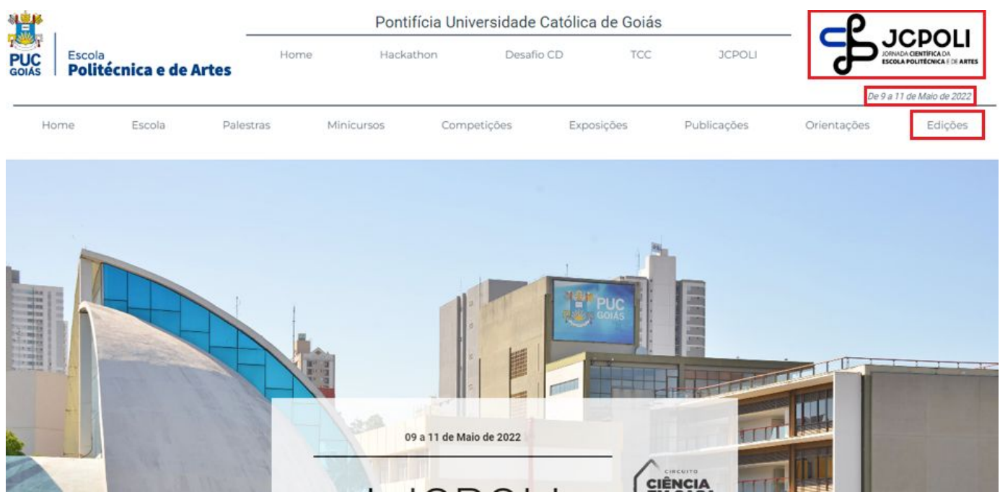

# Evolução do projeto

## Visão geral

Minha atuação na JCPOLI ocorreu em um projeto que mudou de direção durante o desenvolvimento.

O objetivo inicial era integrar o conteúdo da **JCPOLI** ao site da **Escola Politécnica e de Artes da PUC Goiás**.

Ao longo do estágio, entretanto, o projeto passou por novas necessidades:

1. integração dos dois sites;
2. criação de uma área específica para a JCPOLI;
3. inclusão do histórico de edições anteriores;
4. adaptação da navegação para múltiplas edições;
5. implementação da 3ª JCPOLI;
6. decisão de separar novamente os dois sites;
7. reorganização da aplicação JCPOLI como projeto independente;
8. manutenção e atualização do site durante a realização da 3ª edição.

Este documento apresenta essa evolução e as principais decisões técnicas relacionadas à minha atuação.


---

# 1. Situação inicial

No início do estágio existiam aplicações relacionadas à **Escola Politécnica e de Artes** e à **JCPOLI**.

Minha primeira atividade foi compreender a estrutura dos projetos existentes e estudar como o conteúdo da JCPOLI poderia ser incorporado ao site da Escola Politécnica.

O site da Escola já possuía suas próprias páginas e navegação, enquanto a JCPOLI possuía áreas específicas relacionadas ao evento, como:

- Home;
- Escola;
- Palestras;
- Minicursos;
- Competições;
- Exposições;
- Publicações;
- Orientações;
- Programação;
- perfis de palestrantes.

O primeiro desafio foi fazer essas duas estruturas coexistirem dentro da mesma aplicação.

---

# 2. Integração da JCPOLI ao site da Escola Politécnica

A solução inicial foi adicionar uma nova área chamada **JCPOLI** dentro do site da Escola Politécnica.



A implementação envolveu trazer para a aplicação principal:

```text
rotas
views
componentes
assets
models
arquivos de programação
```

Também foi criada uma navegação específica para a JCPOLI.

Nesse estágio do projeto, existiam simultaneamente:

```text
Navegação principal da Escola Politécnica

            ↓

Área JCPOLI

            ↓

Navegação específica da JCPOLI
```

Essa estrutura permitiu preservar as funcionalidades existentes da JCPOLI enquanto o conteúdo passava a ser apresentado dentro do site da Escola.

---

# 3. Primeiras melhorias de interface

Após a integração inicial, o trabalho passou também pela evolução visual da solução.

Foram elaboradas alternativas de layout para definir como a JCPOLI seria apresentada dentro do site da Escola Politécnica.

Entre as alterações implementadas estavam:

- inclusão da identidade visual da JCPOLI na navegação;
- reorganização das barras de navegação;
- ajustes de posicionamento;
- inclusão das datas do evento;
- preparação para uma nova área chamada **Edições**.

Essa etapa começou a transformar o trabalho de simples integração de conteúdo em uma reorganização da experiência de navegação.

---

# 4. Criação da área de Edições

Uma nova necessidade surgiu: permitir que usuários consultassem não apenas a edição atual, mas também edições anteriores da JCPOLI.

Foi então criada uma página específica de **Edições**.

A página passou a apresentar as diferentes edições por meio de banners, permitindo selecionar qual versão do evento seria consultada.

A implementação envolveu:

```text
Edicoes.vue
router.ts
NavBar
router-link
```

A navegação deixou de considerar apenas a página desejada e começou a precisar considerar também a edição selecionada.

---

# 5. Mudança na estratégia de roteamento

Com a inclusão das edições anteriores, a estrutura original de rotas deixou de ser suficiente.

Antes, conceitualmente, a navegação estava mais próxima de:

```text
/palestras
/minicursos
/competicoes
```

Com múltiplas edições, passou a ser necessário identificar duas informações:

```text
EDIÇÃO + PÁGINA
```

Conceitualmente:

```text
/1/palestras
/2/palestras
/3/palestras
```

A implementação exigiu alterações coordenadas em:

```text
router.ts
App.vue
NavBar.vue
NavBarJCPOLI.vue
Edicoes.vue
views
componentes da Home
```

A aplicação passou a utilizar a edição presente na navegação para determinar quais componentes deveriam ser exibidos.

---

# 6. Incorporação da 2ª edição

A partir dessa nova estrutura, comecei a incorporar o conteúdo da **2ª JCPOLI**.

Foram criadas ou adaptadas versões específicas de diferentes áreas:

```text
Home
Escola
Palestras
Minicursos
Competições
Exposições
Publicações
Orientações
```

Cada uma precisava utilizar os conteúdos correspondentes àquela edição.

Isso começou a evidenciar um novo problema: o número de arquivos e variações crescia conforme novas edições eram incorporadas.

---

# 7. Organização progressiva do código

Durante a implementação das múltiplas edições, diferentes convenções de nomes foram utilizadas para distinguir arquivos da Escola Politécnica e da JCPOLI.

Alguns arquivos inicialmente utilizavam sufixos como:

```text
j
JCPOLI
1JCPOLI
2JCPOLI
3JCPOLI
```

À medida que a aplicação crescia, passei a reorganizar esses arquivos para tornar mais clara a estrutura.

Foram criadas áreas específicas para elementos da JCPOLI dentro de:

```text
components/home
components/abasJCPOLI
models
storage/programacao
```

Esse processo ocorreu de forma incremental e acompanhou a evolução das necessidades do projeto.

---

# 8. Implementação da 3ª JCPOLI

Com a estrutura de múltiplas edições já em desenvolvimento, foi incorporado o conteúdo da **3ª JCPOLI**.

Foram implementadas ou atualizadas páginas relacionadas a:

- Home;
- Escola;
- Palestras;
- Minicursos;
- Competições;
- Exposições;
- Publicações / Anais;
- Orientações;
- Ciência em Casa;
- Fotos.

Essa etapa também exigiu novos arquivos de conteúdo, imagens, documentos e informações referentes à edição de 2024.

---

# 9. Organização por edição

O crescimento da quantidade de componentes tornou necessário adotar uma organização mais explícita.

A estrutura evoluiu para separar os arquivos conforme a edição:

```text
components/
└── abasJCPOLI/
    ├── 1_JCPOLI/
    ├── 2_JCPOLI/
    └── 3_JCPOLI/

components/
└── home/
    ├── 1_JCPOLI/
    ├── 2_JCPOLI/
    └── 3_JCPOLI/

storage/
└── programacao/
    ├── 1_JCPOLI/
    ├── 2_JCPOLI/
    └── 3_JCPOLI/
```

Os models relacionados aos conteúdos utilizados pelas páginas também foram reorganizados.

Essa alteração não representou apenas uma mudança de nomes.

O objetivo era permitir que um desenvolvedor identificasse rapidamente:

```text
qual edição
      ↓
qual área
      ↓
qual componente ou conjunto de dados
```

---

# 10. Limitação da solução: ausência de banco de dados externo

Durante essa fase, a versão em que trabalhei não utilizava um banco de dados externo para armazenar dinamicamente o conteúdo das edições.

As informações eram mantidas em arquivos TypeScript e estruturas internas da aplicação.

Por isso, conteúdos como:

- palestrantes;
- palestras;
- minicursos;
- competições;
- exposições;
- publicações;
- programação;

precisavam ser organizados dentro do próprio projeto.

A divisão dos arquivos por edição foi uma solução adotada dentro dessa restrição.

Ela permitiu manter as três edições acessíveis sem criar aplicações completamente independentes para cada uma.

---

# 11. Mudança de requisito

Durante o estágio ocorreu a principal mudança de direção do projeto.

Inicialmente:

```text
Escola Politécnica
        +
      JCPOLI

        ↓

Aplicação integrada
```

Após uma reunião envolvendo as equipes que trabalhavam nos projetos, foi decidido que a **Escola Politécnica e de Artes** e a **JCPOLI** deveriam continuar como sites separados.

Isso significava que uma parte relevante do trabalho de integração já realizado deixava de fazer sentido no formato originalmente planejado.

---

# 12. Preservação do trabalho desenvolvido

Em vez de simplesmente descartar toda a implementação, a estratégia passou a ser preservar o que continuava sendo útil para a JCPOLI.

Foram mantidos principalmente:

- histórico das edições;
- nova estrutura de navegação;
- componentes das diferentes edições;
- melhorias de layout;
- organização dos conteúdos;
- novas páginas;
- ajustes de responsividade.

A aplicação passou então por um processo de retirada das partes específicas da Escola Politécnica.

---

# 13. Separação da JCPOLI

A separação exigiu alterações estruturais importantes.

Foram removidos ou reorganizados elementos que haviam sido incorporados durante a integração.

Entre as mudanças estavam:

```text
remoção de páginas da Escola Politécnica
remoção de rotas não pertencentes à JCPOLI
remoção de storages do outro site
simplificação da navegação
remoção da segunda navbar
renomeação das views
revisão das rotas
```

A aplicação deixou de precisar identificar quais elementos pertenciam à Escola e quais pertenciam à JCPOLI.

Isso permitiu simplificar nomenclaturas que haviam sido necessárias durante a fase de integração.


---

# 14. Simplificação das views

Durante a integração, muitas views possuíam nomes específicos como:

```text
PalestrasJCPOLI.vue
CompeticaoJCPOLI.vue
EscolaJCPOLI.vue
EdicoesJCPOLI.vue
```

Após a separação, o sufixo deixou de ser necessário.

Os nomes puderam voltar a representar diretamente a função da página:

```text
Palestras.vue
Competicao.vue
Escola.vue
Edicoes.vue
```

Esse processo também exigiu atualização das referências utilizadas pelo roteamento e por outros componentes.

---

# 15. Estrutura final da minha versão

Ao final da minha etapa de desenvolvimento, a aplicação JCPOLI possuía uma estrutura independente e suporte às três edições.

De forma simplificada:

```text
Usuário
   ↓
Vue Router
   ↓
Identificação da edição
   ↓
View correspondente
   ↓
Componente da edição
   ↓
Dados específicos da edição
```

A divisão dos componentes ficou conceitualmente próxima de:

```text
                  ┌── 1ª JCPOLI
Página / View ────├── 2ª JCPOLI
                  └── 3ª JCPOLI
```

A mesma lógica era aplicada aos dados específicos das diferentes edições.

---

# 16. Atualizações durante a realização do evento

Durante a 3ª JCPOLI, o projeto entrou em uma fase diferente.

Além das alterações estruturais, passou a ser necessário atualizar informações conforme o próprio evento acontecia.

Foram realizadas alterações relacionadas a:

- palestras;
- minicursos;
- Ciência em Casa;
- competições;
- resultados;
- certificados;
- orientações;
- publicações;
- fotografias.

Isso exigia mudanças rápidas no conteúdo mantendo o restante da aplicação funcional.

---

# 17. Evolução das páginas de eventos

Nas etapas finais, também foram aprimoradas as telas utilizadas para apresentar atividades como:

```text
Palestras
Minicursos
Ciência em Casa
```

A apresentação passou a incluir elementos como:

- fotografia do palestrante;
- acesso ao perfil;
- informações adicionais;
- acesso a certificados.

As alterações envolveram componentes Vue, CSS, models TypeScript e arquivos de programação.

---

# 18. Versionamento e branches

Minha atuação ficou registrada principalmente em duas branches.

### `abe-juncaojcpolipolitecnica`

Utilizada durante a fase em que o objetivo era integrar a JCPOLI ao site da Escola Politécnica.

Ela preserva o desenvolvimento realizado até a decisão de separar novamente os projetos.

### `abe-sitejcpoli-teste`

Criada após a mudança de direcionamento.

Ela passou a concentrar a versão independente da JCPOLI contendo:

- histórico das edições;
- reorganização estrutural;
- implementação da 3ª edição;
- melhorias de layout;
- atualizações realizadas durante o evento.

A versão final dessa branch foi posteriormente integrada à linha principal utilizada pela equipe.

---

# Linha do tempo resumida

```text
MARÇO/2024
│
├── Estudo da estrutura existente
│
├── Integração inicial da JCPOLI
│
├── Rotas, views e navbar
│
└── Transferência das páginas existentes
│
▼
ABRIL/2024
│
├── Criação da área de Edições
│
├── Nova estratégia de roteamento
│
├── Inclusão da 2ª JCPOLI
│
└── Primeiras reorganizações estruturais
│
▼
MAIO/2024
│
├── Implementação da 3ª JCPOLI
│
├── Ciência em Casa e Fotos
│
├── Ajustes de responsividade
│
├── Mudança de requisito
│
├── Separação dos sites
│
└── Reorganização por edição
│
▼
JUNHO/2024
│
├── Evolução das telas
│
├── Atualizações do evento
│
├── Certificados e resultados
│
└── Consolidação da minha versão
```

---

# Principal aprendizado técnico

A parte mais relevante dessa evolução não foi apenas a criação de novas páginas.

O projeto exigiu adaptar continuamente uma aplicação existente a mudanças de estrutura e requisitos.

A mesma base de código passou por três estados diferentes:

```text
JCPOLI independente
        ↓
JCPOLI integrada à Escola Politécnica
        ↓
JCPOLI novamente independente,
agora com suporte a múltiplas edições
```

Isso exigiu compreender código legado, integrar estruturas existentes, revisar decisões anteriores e reorganizar componentes quando o contexto do projeto mudou.

---

# Documentação relacionada

Para ver especificamente as funcionalidades e alterações realizadas por mim:

➡️ [Minhas contribuições](minhas-contribuicoes.md)

Para consultar os commits e branches utilizados como evidência:

➡️ [Evidências e histórico Git](evidencias.md)

Para compreender a organização técnica da aplicação:

➡️ [Arquitetura frontend](arquitetura-frontend.md)