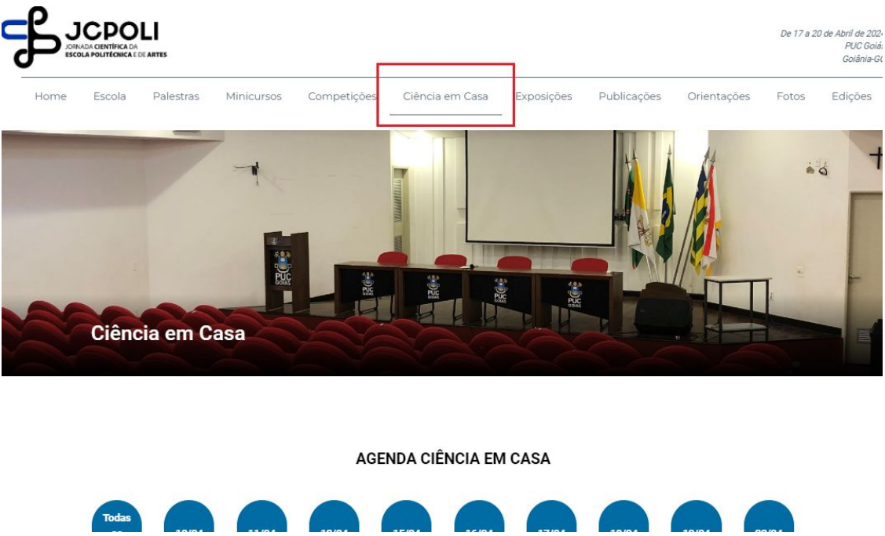
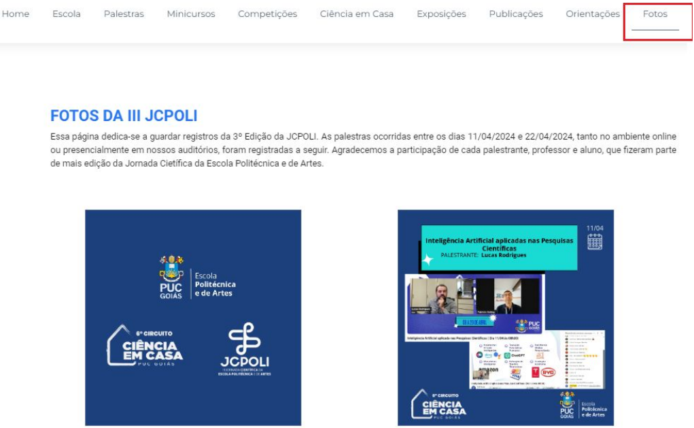

# Minhas contribuições

## Visão geral

Minha atuação na JCPOLI ocorreu durante o estágio supervisionado realizado na **PUC Goiás em 2024**, com foco no desenvolvimento frontend utilizando **Vue.js e TypeScript**.

O projeto já possuía código e histórico anteriores à minha entrada. O desenvolvimento também era colaborativo, com outros estagiários trabalhando paralelamente em diferentes funcionalidades.

Por esse motivo, este documento descreve especificamente as atividades realizadas por mim e que puderam ser reconstruídas a partir de:

- relatório de estágio produzido durante o projeto;
- histórico Git preservado;
- branches utilizadas durante meu desenvolvimento;
- commits associados ao meu usuário;
- código-fonte recuperado.

Minhas principais branches foram:

```text
abe-juncaojcpolipolitecnica
abe-sitejcpoli-teste
````

---

# 1. Integração da JCPOLI ao site da Escola Politécnica

A primeira etapa da minha atuação consistiu em integrar o conteúdo do site da **JCPOLI** ao site da **Escola Politécnica e de Artes**.

Os dois projetos possuíam estruturas e conteúdos próprios, e o objetivo inicial era permitir que a JCPOLI passasse a ser acessada como uma área dentro do site da Escola.

Para isso, trabalhei na incorporação das páginas, componentes, rotas e dados necessários para reproduzir dentro da aplicação principal as funcionalidades existentes no site da JCPOLI.

Entre as áreas integradas estavam:

* Home;
* Escola;
* Palestras;
* Minicursos;
* Competições;
* Exposições;
* Publicações / Anais;
* Orientações;
* Programação;
* perfis de palestrantes.

Também foi criada uma navegação específica para a JCPOLI dentro da aplicação.

Essa etapa envolveu principalmente alterações em:

```text
router.ts
App.vue
NavBar.vue
views/
components/
models/
storage/programacao/
```

---

# 2. Adaptação do roteamento

Com a incorporação da JCPOLI, foi necessário adaptar o sistema de rotas para suportar as novas páginas.

Inicialmente, foram adicionadas as rotas correspondentes às diferentes áreas da JCPOLI.

Posteriormente, com a inclusão das edições anteriores do evento, a navegação precisou evoluir para identificar não apenas **qual página estava sendo acessada**, mas também **qual edição da JCPOLI estava ativa**.

A solução passou a trabalhar conceitualmente com uma estrutura semelhante a:

```text
/edicao/pagina
```

Por exemplo:

```text
1ª edição → Palestras
2ª edição → Palestras
3ª edição → Palestras
```

O roteamento, a aplicação principal e os componentes de navegação foram adaptados para utilizar essa informação e carregar o conteúdo correspondente.

Essa foi uma das alterações estruturais mais importantes realizadas durante o projeto.

---

# 3. Criação da área de Edições

Implementei uma área específica para permitir o acesso às diferentes edições da JCPOLI.

A tela apresentava as edições existentes por meio de banners e permitia ao usuário selecionar qual edição desejava consultar.

Também implementei:

* nova rota para a página;
* integração com a navbar;
* navegação dos banners utilizando `router-link`;
* ajustes de layout;
* correções de responsividade.

Essa funcionalidade se tornou o ponto de entrada para a navegação histórica das edições do evento.

---

# 4. Suporte a múltiplas edições

O suporte às edições anteriores foi um dos principais desafios técnicos do projeto.

Cada edição possuía conteúdos próprios, incluindo:

* palestrantes;
* palestras;
* minicursos;
* competições;
* exposições;
* publicações;
* datas;
* imagens;
* comissões;
* informações específicas da programação.

Na versão em que trabalhei, esses dados ainda não estavam centralizados em um banco de dados externo.

Foi necessário, portanto, estruturar a aplicação para permitir que as diferentes versões coexistissem no mesmo projeto.

A solução evoluiu para uma separação explícita dos componentes e dados por edição.

Exemplo simplificado:

```text
components/
├── abasJCPOLI/
│   ├── 1_JCPOLI/
│   ├── 2_JCPOLI/
│   └── 3_JCPOLI/
│
└── home/
    ├── 1_JCPOLI/
    ├── 2_JCPOLI/
    └── 3_JCPOLI/

storage/
└── programacao/
    ├── 1_JCPOLI/
    ├── 2_JCPOLI/
    └── 3_JCPOLI/
```

As views passaram a atuar como pontos comuns de entrada, selecionando os componentes adequados conforme a edição presente na navegação.

Isso evitava a necessidade de criar uma aplicação completamente separada para cada edição e permitia manter o histórico dentro do mesmo site.

---

# 5. Implementação da 2ª edição

Como parte do processo de preservação do histórico da JCPOLI, trabalhei na inclusão do conteúdo referente à **2ª edição**.

Foram implementadas ou adaptadas áreas relacionadas a:

* Home;
* Escola;
* Palestras;
* Minicursos;
* Competições;
* Exposições;
* Publicações / Anais;
* Orientações.

Também foram adicionados os dados e assets necessários para que cada página apresentasse o conteúdo correspondente àquela edição.

---

# 6. Implementação da 3ª edição

Também participei diretamente da implementação das páginas referentes à **3ª JCPOLI**.

Entre as áreas implementadas ou atualizadas estavam:

* Home;
* Escola;
* Palestras;
* Minicursos;
* Competições;
* Exposições;
* Publicações / Anais;
* Orientações;
* Ciência em Casa;
* Fotos.

As páginas utilizavam componentes Vue e arquivos TypeScript contendo os dados específicos daquela edição.

---

# 7. Ciência em Casa e Fotos

Durante a evolução da 3ª edição, foram adicionadas novas áreas ao site.


#### Fonte: Imagem comprimida do Relatório JCPOLI


#### Fonte: Imagem comprimida do Relatório JCPOLI

Uma delas foi **Ciência em Casa**, incorporada à estrutura de navegação e aos dados da programação.

Também implementei a área de **Fotos**, incluindo:

* nova página;
* componente específico;
* integração à navbar;
* rota correspondente;
* assets utilizados pela galeria.

Essa funcionalidade passou a permitir a apresentação de registros visuais da edição do evento.

---

# 8. Evolução das telas de Palestras e Minicursos

Também trabalhei na evolução da apresentação das informações dos eventos.


#### Fonte: Imagem comprimida do Relatório JCPOLI

As telas de **Palestras**, **Minicursos** e **Ciência em Casa** foram adaptadas para apresentar informações adicionais relacionadas aos palestrantes.

Entre as alterações estavam:

* fotografia do palestrante;
* acesso ao perfil completo;
* reorganização visual das informações;
* links relacionados aos certificados.

Esse trabalho envolveu alterações coordenadas entre:

```text
componentes Vue
CSS
TypeScript
models
arquivos de dados da programação
```

---

# 9. Perfis de palestrantes

O projeto possuía páginas específicas para visualização das informações dos palestrantes.

Durante a integração e evolução da JCPOLI, trabalhei na adaptação do histórico de palestrantes, nas rotas utilizadas para acessar seus perfis e na organização dos dados utilizados pelas páginas.

Com a implementação de múltiplas edições, esses dados também precisaram considerar os diferentes participantes ao longo da história do evento.

---

# 10. Responsividade

Também realizei ajustes de responsividade em partes da aplicação.

Entre os pontos trabalhados estavam:

* página de Edições;
* navegação da JCPOLI;
* comportamento da navbar em dispositivos móveis;
* organização das páginas em diferentes dimensões de tela.

Algumas das soluções precisaram considerar a existência simultânea da navegação geral da Escola Politécnica e da navegação específica da JCPOLI.

---

# 11. Organização e refatoração do projeto

Conforme novas edições eram adicionadas, a estrutura inicial começou a acumular arquivos com prefixos e sufixos utilizados para diferenciar conteúdos.

Realizei diferentes etapas de reorganização para tornar mais clara a separação das responsabilidades.

Entre elas:

* padronização dos nomes das views;
* reorganização dos componentes por edição;
* reorganização dos arquivos da Home;
* reorganização dos arquivos de programação;
* reorganização dos models utilizados pelas páginas;
* remoção de nomenclaturas temporárias;
* comentários explicativos em partes do código.

Um dos principais resultados foi a separação explícita dos arquivos entre:

```text
1_JCPOLI
2_JCPOLI
3_JCPOLI
```

Isso tornou mais evidente qual conteúdo pertencia a cada edição.

---

# 12. Mudança de requisito: separação dos sites

Durante o estágio ocorreu uma mudança importante no direcionamento do projeto.

Inicialmente, minha tarefa era integrar a JCPOLI ao site da Escola Politécnica e de Artes.

Posteriormente, após uma decisão da equipe responsável pelos projetos, foi definido que os dois sites deveriam permanecer separados.

Isso exigiu adaptar uma solução que já havia sido parcialmente construída.

Em vez de simplesmente abandonar o trabalho realizado, reorganizei a implementação para preservar as funcionalidades desenvolvidas e transformar novamente a JCPOLI em uma aplicação independente.

Entre as alterações realizadas estavam:

* remoção de páginas específicas da Escola Politécnica;
* remoção de rotas que não pertenciam à JCPOLI;
* simplificação da navbar;
* revisão do roteamento;
* renomeação das views;
* reorganização de componentes;
* reorganização dos dados por edição.

Essa etapa foi relevante por exigir adaptação a uma mudança de requisito durante o desenvolvimento.

---

# 13. Atualizações durante a 3ª JCPOLI

Durante a realização da 3ª edição, o site precisava acompanhar alterações do próprio evento.

Também participei dessas atualizações, incluindo:

* novas informações de palestras e minicursos;
* atualização de competições;
* publicação de resultados;
* atualização de certificados;
* informações de orientações;
* atualização de publicações;
* conteúdo de Ciência em Casa;
* resultados de concurso de fotografia.

Nesse período, o trabalho deixou de ser apenas evolução estrutural e passou a incluir também manutenção de uma aplicação vinculada a um evento em andamento.

---

# 14. Git e desenvolvimento colaborativo

O projeto foi desenvolvido de maneira colaborativa utilizando **Git e GitHub**.

Cada estagiário possuía branches próprias para desenvolver suas atividades antes da integração com as versões compartilhadas.

Minhas principais branches foram:

```text
abe-juncaojcpolipolitecnica
abe-sitejcpoli-teste
```

O histórico preservado possui dezenas de commits atribuídos diretamente ao meu usuário.

Esse histórico permite acompanhar a evolução do meu trabalho desde a integração inicial dos dois sites até a versão independente da JCPOLI com suporte às três edições.

---

# Principais tecnologias utilizadas

Minha atuação documentada neste projeto envolveu principalmente:

```text
Vue.js 2
TypeScript
JavaScript
HTML
CSS / Sass
Vue Router
Vue CLI
Git
GitHub
```

Outras tecnologias aparecem no projeto colaborativo, mas não são apresentadas neste estudo de caso como parte da minha contribuição individual sem evidência correspondente no histórico preservado.

---

# O que considero mais relevante nesta experiência

Além da implementação das telas, o projeto exigiu lidar com problemas comuns no desenvolvimento de software:

### Evolução de uma base de código existente

O desenvolvimento ocorreu sobre aplicações criadas e mantidas anteriormente por outros estudantes.

Foi necessário compreender a estrutura existente antes de realizar alterações.

### Integração entre aplicações

A primeira etapa exigiu incorporar funcionalidades de uma aplicação dentro de outra mantendo suas características.

### Organização de múltiplas versões

Foi necessário permitir que conteúdos de diferentes edições coexistissem dentro da mesma aplicação.

### Mudança de requisitos

A decisão de separar novamente os sites exigiu reorganizar uma implementação que já estava em andamento.

### Manutenção durante uso real

Durante a realização da 3ª JCPOLI, o site precisava acompanhar informações e mudanças do evento.

### Trabalho colaborativo

As alterações eram desenvolvidas em branches e posteriormente integradas aos repositórios utilizados pela equipe.

---

# Evidências

Os commits, branches e alterações utilizadas para reconstruir esta participação estão documentados separadamente em:

➡️ [Evidências e histórico Git](evidencias.md)

Para compreender a evolução completa do projeto:

➡️ [Evolução do projeto](evolucao-do-projeto.md)
